# Introduction

Welcome to the WorkReduce API! You can use our API to access WorkReduce API endpoints, which can get information on various tasks and orders on our platform.

We have language bindings in Shell, Ruby, Python, and JavaScript!  As you scroll down the page, you will be able to view code examples in the dark area to the right, and you can switch the programming language of the examples with the tabs in the top right.

<aside class="notice">
The WorkReduce API is versioned by release date.  If you are just getting started, we recommend using the most recently released version of the API.  If you are using one of our libraries for Python, Ruby, or Node.js, this will be handled for you automatically.<br /><br />

If you are rolling your own connection via curl, you will need to ensure the URL endpoints contain the API release version you are using.<br /><br />

For example, requests to "https://api.workreduce.com/v2/orders" would go to version 2 of the API.
</aside>

API Version | Release date | Current Version?
--------- | ------- | -------
v2 | 07-05-2018 | **Yes**
v1 | 05-25-2018 | No


# Authentication

> To authorize, use this code:


```shell
# With shell, you can just pass the correct header with each request
curl "api_endpoint_here"
  -H "Authorization: meowmeowmeow"
```


> Make sure to replace `meowmeowmeow` with your API key.


### Getting access to the API

WorkReduce uses API keys to allow access to the API. You can request access to the WorkReduce API by having a conversation with your Client Director, who will set you up with an API key.

### Authorizing your requests

WorkReduce expects for the API key to be included in all API requests to the server in an HTTP header that looks like the following:

`Authorization: meowmeowmeow`

<aside class="notice">
You must replace <code>meowmeowmeow</code> with your organization's API key.
</aside>


# Order Lifecycle


### Diagram

Orders go through the following lifecycle with regards to their `status`:

<style>
.svg-img {
  padding-left: 50px;
}
.svg-img img {
  height: 600px;
  max-height: 600px;
}
</style>
<div class="svg-img">

   Activated -> Accepted -> In Progress -> Submitted -> In QA -> QA Complete -> Completed -> Delivered -> Approved">
</div>


### Values for Order `status` field

Value | Description
------------ | ------------
`Draft` | Order only submitted: this usually means something is missing such as attachments or sufficient detail
`Activated` | Order has been submitted by the client and ready to work on
`Accepted` | Order has been accepted by worker
`In Progress` | Order is in progress
`Submitted` | Order has been submitted by worker, ready for review
`In QA` | Order is in QA
`QA Complete` | QA has been completed
`Delivered` | Order is complete, ready to be approved by client
`Approved` | Order is complete and client has approved the task
`Canceled` | Order canceled by WorkReduce
`Client Canceled` | Order canceled by the client


# Orders

## Get Individual Order

```shell
curl "https://api.workreduce.com/v2/orders/00007847"
  -H "Authorization: meowmeowmeow"
```


> The above command returns JSON structured like this:

```json
{
  "account_name": "Media Company",
  "account_id": "WRCUST43442",
  "created_at": "2018-05-03T18:30:00Z",
  "activated_at": "2018-05-03T18:36:06Z",
  "completed_at": "2018-05-03T19:44:33Z",
  "order_number": "00007847",
  "name": "QA Screenshot of Ad Creative - BigCo",
  "status": "Complete",
  "due_date": "2018-05-03T18:30:00Z",
  "requester_email": "george@big-agency.com",
  "team": "MENA launch ads",
  "work_request": {
    "notes": [
      {
        "created_at": "2018-05-03T18:30:00Z",
        "text": "Please look at the tag code..."
      }
    ],
    "attachments": [
      {
        "created_at": "2018-05-03T18:30:00Z",
        "url": "https://s3.workreduce.com/bigagency/tag_screenshot.jpg"
      },
      {
        "created_at": "2018-05-03T18:30:00Z",
        "url": "https://s3.workreduce.com/bigagency/spreadsheet_details.xlsx"
      }
    ]
  },
  "work_result": {
    "total_billable_hours": 0.5,
    "notes": [
      {
        "created_at": "2018-05-03T19:44:04Z",
        "text": "Task completed without any issues"
      }
    ],
    "attachments": [
      {
        "created_at": "2018-05-03T19:44:33Z",
        "url": "https://s3.workreduce.com/bigagency/completed_screenshot.jpg"
      }
    ]
  },
  "task_type": "qa_screenshot",
  "task_type_category": "Screenshots"
}
```

This endpoint retrieves all details for a specific open order for your account.

### HTTP Request

`GET https://api.workreduce.com/v2/orders/<OrderNumber>`


<aside class="success">
Remember — a happy WorkReduce API request is an authenticated request!
</aside>


## Get All Orders


```shell
curl "https://api.workreduce.com/v2/orders"
  -H "Authorization: meowmeowmeow"
```

> The above command returns JSON structured like this:

```json
[
  {
    "account_name": "Media Company",
    "account_id": "WRCUST43442",
    "order_number": "00007847",
    "name": "QA Screenshot of Ad Creative - BigCo",
    "status": "Complete",
    "due_date": "2018-05-03T18:30:00Z",
    "created_at": "2018-05-03T18:30:00Z",
    "activated_at": "2018-05-03T18:36:06Z",
    "completed_at": "2018-05-03T19:44:33Z",
    "requester_email": "george@big-agency.com",
    "team": "MENA launch ads",
    "work_request": {
      "notes": [
        {
          "created_at": "2018-05-03T18:30:00Z",
          "text": "Please look at the tag code..."
        }
      ],
      "attachments": [
        {
          "created_at": "2018-05-03T18:30:00Z",
          "url": "https://s3.workreduce.com/bigagency/tag_screenshot.jpg"
        },
        {
          "created_at": "2018-05-03T18:30:00Z",
          "url": "https://s3.workreduce.com/bigagency/spreadsheet_details.xlsx"
        }
      ]
    },
    "work_result": {
      "total_billable_hours": 0.5,
      "notes": [
        {
          "created_at": "2018-05-03T19:44:04Z",
          "text": "Task completed without any issues"
        }
      ],
      "attachments": [
        {
          "created_at": "2018-05-03T19:44:33Z",
          "url": "https://s3.workreduce.com/bigagency/completed_screenshot.jpg"
        }
      ]
    },
    "task_type": "qa_screenshot",
    "task_type_category": "Screenshots"
  },
  {
    "account_name": "Media Company",
    "account_id": "WRCUST43442",
    "order_number": "00007848",
    "name": "QA Screenshot of Ad Creative - BigCo - Another",
    "status": "Approved",
    "created_at": "2018-05-04T18:30:00Z",
    "activated_at": "2018-05-04T18:36:06Z",
    "completed_at": "2018-05-04T19:44:33Z",
    "due_date": "2018-05-04T18:30:00Z",
    "requester_email": "george@big-agency.com",
    "team": "MENA launch ads",
    "work_request": {
      "notes": [
        {
          "created_at": "2018-05-04T18:30:00Z",
          "text": "Please look at the tag code (again)..."
        }
      ],
      "attachments": [
        {
          "created_at": "2018-05-04T18:30:00Z",
          "url": "https://s3.workreduce.com/bigagency/tag_screenshot2.jpg"
        },
        {
          "created_at": "2018-05-03T18:30:00Z",
          "url": "https://s3.workreduce.com/bigagency/spreadsheet_details2.xlsx"
        }
      ]
    },
    "work_result": {
      "total_billable_hours": 0.5,
      "notes": [
        {
          "created_at": "2018-05-04T19:44:04Z",
          "text": "Task completed without any issues (again)"
        }
      ],
      "attachments": [
        {
          "created_at": "2018-05-04T19:44:33Z",
          "url": "https://s3.workreduce.com/bigagency/completed_screenshot2.jpg"
        }
      ]
    },
    "task_type": "qa_screenshot",
    "task_type_category": "Screenshots"
  }
]
```

This endpoint retrieves all open orders for your account.

### HTTP Request

`GET https://api.workreduce.com/v2/orders`


### Pagination

The WorkReduce Get All Orders API route utilizes cursor-based pagination via the `starting_after` and `ending_before` parameters. Both parameters take an existing Order Number (see below) and return Orders in reverse chronological order. The `ending_before` parameter returns Orders listed before the named Order. The `starting_after` parameter returns Orders listed after the named Order. If both parameters are provided, only ending_before is used.


### URL Parameters

Parameter | Description | Additional Info
--------- | ----------- | -----------
status | Filter the result for Orders that match the status.  [See table with acceptable values for `status`](#order-status-values). | Optional.  Default behavior is not to filter.
limit | A limit on the number of Orders to be returned, between 1 and 100 | Optional. Default is 10.
starting_after | A cursor for use in pagination. starting_after is a WorkReduce Order Number that defines your place in the list. For instance, if you make a list request and receive 100 objects, ending with obj_foo, your subsequent call can include starting_after=obj_foo in order to fetch the next page of the list. | Optional
ending_before | A cursor for use in pagination. ending_before is a WorkReduce Order Number that defines your place in the list. For instance, if you make a list request and receive 100 objects, starting with obj_bar, your subsequent call can include ending_before=obj_bar in order to fetch the previous page of the list. | Optional


## New Order

```shell
curl "https://api.workreduce.com/v2/orders" \
  -H "Authorization: meowmeowmeow" \
  -d name="This is the name for the order" \
  -d description="This is some longer description for the order" \
  -d due_date="2018-05-14T18:30:00Z" \
  -d task_type="qa_screenshot" \
  -d team="EMEA Mobile Team" \
  -d requester_email="emea@ads-agency.com" \
  -F "attachments[]=@screenshot.jpg" -F "attachments[]=@screenshot2.gif"
```


> The above command returns JSON structured like this:

```json
{
  "order_number": "00007848",
  "created" : "success"
}
```

This endpoint creates a new Order.

### HTTP Request

`POST https://api.workreduce.com/v2/orders`

### URL Parameters

Parameter | Description
--------- | -----------
name | The name for the Order
due_date | The due date of the Order, formatted according to ISO 8601
description | A description containing instructions for executing the Order
attachments | A list of files to attach to the Order
task_type | The task type of the order.  Get this from the list of codes of [task types available to your account](#list-all-task-types).  We do not support filtering by task_type_category.
team | Your team or pod within your organization
requester_email | The email of the person at your organization who is creating the order


## Update An Existing Order


```shell
curl "https://api.workreduce.com/v2/orders" \
  -H "Authorization: meowmeowmeow" \
  -d order_number="00007848" \
  -d name="This is the updated name for the order" \
  -d description="This is the updated desc for the order" \
  -d due_date="2018-05-14T18:30:00Z" \
  -d task_type="qa_screenshot" \
  -F "attachments[]=@new_screenshot.jpg" -F "attachments[]=@new_screenshot2.gif"
```

> The above command returns JSON structured like this:

```json
{
  "order_number": "00007848",
  "updated" : "success"
}
```

### HTTP Request

`PUT https://api.workreduce.com/v2/orders/<OrderNumber>`

### URL Parameters

Parameter | Required | Description
--------- | ----------- | -----------
order_number | Required | The ID of the Order to update - all numeric and left-padded with zeros.
name | Optional | The new name of the Order
description | Optional| The new description of the Order
due_date | Optional| The new due date for the Order.  ISO 8601.
attachments | Optional | Any new attachments for the Order.  Does not delete old attachments.
task_type | Optional | The new task type of the order.  Get this from the list of codes of [task types available to your account](#list-all-task-types)

### Notes

You must pass in at least one optional parameter or the API will return a [400 Error](#errors).

## Cancel An Existing Order

```shell
curl "https://api.workreduce.com/v2/orders/00007848"
  -X DELETE
  -H "Authorization: meowmeowmeow"
```

> The above command returns JSON structured like this:

```json
{
  "order_number": "00007848",
  "deleted" : "success"
}
```

This endpoint cancels a specific Order.

### HTTP Request

`DELETE https://api.workreduce.com/v2/orders/<OrderNumber>`

### URL Parameters

Parameter | Description
--------- | -----------
OrderNumber | The ID of the Order to delete


# Tasks

## List All Task Types

```shell
curl "https://api.workreduce.com/v2/tasks"
  -H "Authorization: meowmeowmeow"
```
> The above command returns JSON structured like this:

```json
[
  {
    "task_type": "qa_screenshot",
    "task_type_category": "Screenshots",
    "description": "QA Screenshot of Ad Creative",
  },
  {
    "task_type": "recon",
    "task_type_category": "Reconciliation",
    "description": "Reconciliation of quarterly ad spend",
  }
]
```

This endpoint retrieves all task types your account is authorized to request.

### HTTP Request

`GET https://api.workreduce.com/v2/tasks`


<aside class="notice">
  You cannot use the API to create a new task type.  If you need to setup a new task type for usage with the API, contact your Client Director.
</aside>
